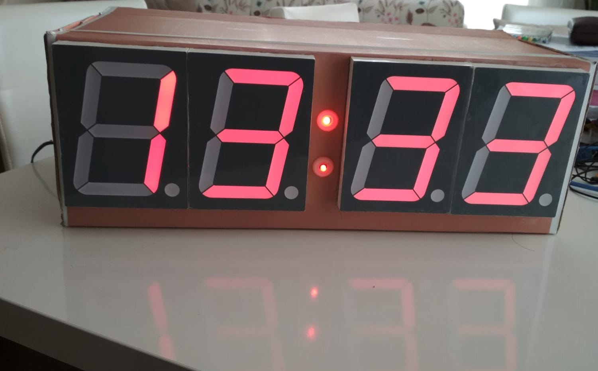

# Digital-Clock-Using-Microcontroller

In this project we made digital clock. We used microcontroller which one is PIC16F877A and seven segment displays. We have made our clock, adjustable time with push buttons.
A list of materials;
* PIC16F877A
* 4 seven segment displays
* 4 Bcd to Seven Segment Decoder (74LS47)
* Crystal 20MHz
* 5 push buttons
* 2 leds
* and a lot of capacitors and resistors

**Hardware Schematic**

**12:34**

C0-C1-C2-C3 => **4** 
C4-C5-C6-C7 => **3** 
D0-D1-D2-D3 => **2** 
D4-D5-D6-D7 => **1**

B0 => SET 
B1 => UP 
B2 => DOWN 
B3 => RIGHT 
B3 => LEFT 
B5 => blinks led every second

**Flowchart of Clock**

**Flowchart of Interrupt**

**Result**

